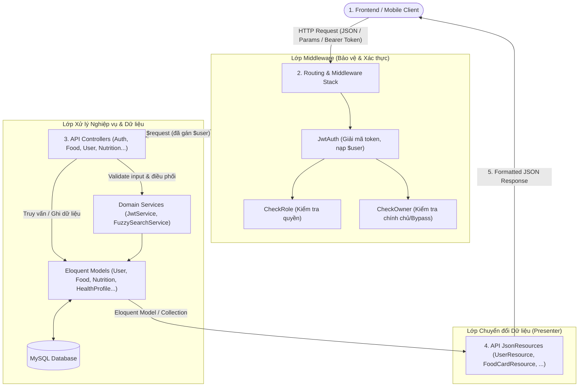

# FoodLife

Hệ thống quản lý dinh dưỡng và gợi ý món ăn thông minh FoodLife (Backend RESTful API xây dựng trên nền tảng PHP Laravel).

---

## 1. Kiến trúc Server

Hệ thống Backend được xây dựng theo mô hình kiến trúc phân lớp chuẩn của Laravel Framework, đảm bảo tính bảo mật, hiệu năng cao và khả năng mở rộng:



### Middleware

| File           | Alias      | Vai trò & Nhiệm vụ chính                                                                                                                                                                                   |
| :------------- | :--------- | :--------------------------------------------------------------------------------------------------------------------------------------------------------------------------------------------------------- |
| JwtAuth.php    | `jwt.auth` | **Xác thực danh tính (Authentication):** Đọc `Bearer Token`, giải mã JWT, kiểm tra tài khoản có bị `BANNED` không và nạp thông tin `$user` vào Request (`$request->setUserResolver()`).                    |
| CheckRole.php  | `role`     | **Phân quyền theo vai trò (Role Authorization):** Kiểm tra `role` của user vừa xác thực có nằm trong danh sách được phép không (VD: `role:ADMIN,MODERATOR`).                                               |
| CheckOwner.php | `owner`    | **Kiểm tra quyền sở hữu (Ownership Authorization):** Kiểm tra xem `userId` trong URL/Body có trùng với user đang đăng nhập không, hoặc cho phép bypass nếu user mang role đặc quyền (ví dụ `owner:ADMIN`). |

**Thứ tự thực thi khi có request gửi đến:**

1. **Bước 1 — jwt.auth (Luôn chạy đầu tiên):**
   - Là middleware cấp nhóm route (`Route::middleware(['jwt.auth'])->group(...)`), luôn thực hiện trước tiên khi client truy cập bất kỳ route nào trong nhóm đó.

2. **Bước 2 — `role` hoặc `owner` (tùy route mà có thứ tự chạy khác nhau):** Là middleware cấp route:
   - **Nếu route chỉ định quyền theo Role** (VD: `Route::get('/users')->middleware('role:ADMIN,MODERATOR')`): `role` chạy.
   - **Nếu route thao tác với dữ liệu cá nhân** (VD: `Route::get('/users/{id}')->middleware('owner:ADMIN,MODERATOR')`): `owner` chạy.

3. **Bước 3 — Controller Handler:**
   - Sau khi vượt qua các lớp Middleware trên, request mới chính thức được chuyển tới Controller xử lý nghiệp vụ.

### Quy trình xác thực bằng access token và refresh token

| Tiêu chí                  | Access Token                                                                                                         | Refresh Token                                                                         |
| :------------------------ | :------------------------------------------------------------------------------------------------------------------- | :------------------------------------------------------------------------------------ |
| **Thời gian sống (TTL)**  | **1 giờ** (`3600s`)                                                                                                  | **30 ngày** (`2592000s`)                                                              |
| **Bản chất**              | **Stateless (JWT)** — Server không cần lưu vào Database hay Cache để kiểm tra, chỉ cần verify chữ ký.                | **Stateful (Opaque String)** — Chuỗi ngẫu nhiên 64 ký tự an toàn (`Str::random(64)`). |
| **Nơi lưu trữ ở Server**  | Không lưu (tự mang thông tin trong Payload).                                                                         | Lưu trong **Cache** (`refresh_token:<token> -> user_id`).                             |
| **Nơi lưu trữ**           | Local State của ứng dụng.                                                                                            | HttpOnly Cookie (client), Database (để đối chiếu).                                    |
| **Thuật toán & Cấu trúc** | Ký `HS256` với Secret Key.<br>Payload gồm: `user_id`, `user_role`, `exp` (hạn sử dụng), `iat` (thời điểm phát hành). | Chuỗi chuỗi băm ngẫu nhiên 64 ký tự.                                                  |
| **Cách gửi lên Server**   | Header: `Authorization: Bearer <token>`                                                                              | Tự động gửi qua Cookie hoặc JSON body `{ "refreshToken": "..." }`.                    |

## 2. Hướng dẫn cài đặt và khởi chạy dự án

### Yêu cầu môi trường

- **PHP**: Phiên bản 8.3 trở lên.
- **Composer**: Phiên bản 2.x trở lên.
- **PHP Extensions**: Đảm bảo đã bật các extension: `mbstring`, `openssl`, `pdo_mysql`, `mysqli`, `intl`, `curl`, `fileinfo`.

### Bước 1: Cấu hình kết nối Database

Đảm bảo tồn tại file `server/.env` chứa các biến sau:

- `DB_CONNECTION`: Loại kết nối.
- `DB_HOST`: Địa chỉ máy host server database.
- `DB_PORT`: Số port server database.
- `DB_DATABASE`: Tên database.
- `DB_USERNAME`: Tên đăng nhập.
- `DB_PASSWORD`: Mật khẩu.
- `MYSQL_ATTR_SSL_CA`: Đường dẫn lưu chứng chỉ SSL (`ca.pem`).

Kiểm tra kết nối tới cơ sở dữ liệu:

```sh
cd server
php artisan db:show
```

### Bước 2: Cài đặt các gói phụ thuộc (Composer Dependencies)

Tại thư mục `server`, chạy lệnh:

```sh
composer install
```

### Bước 3: Sinh tài liệu API Swagger (OpenAPI)

Để sinh hoặc làm mới tài liệu Swagger:

```sh
php artisan l5-swagger:generate
```

### Bước 4: Khởi chạy Server Backend

Chạy máy chủ phát triển cục bộ (Local Development Server):

```sh
php artisan serve
```

Server sẽ chạy tại địa chỉ: **`http://localhost:8000`**

- **Health Check Endpoint**: `http://localhost:8000/api/`
- **Giao diện Swagger UI Documentation**: `http://localhost:8000/api/documentation`

### Bước 5: Chạy kiểm thử tự động (Automated Testing)

Hệ thống đã tích hợp bộ kiểm thử tính năng hoàn chỉnh (Feature Tests) sử dụng Pest PHP:

```sh
# Chạy toàn bộ test suite
php artisan test

# Chạy riêng API tests
php artisan test --filter=ApiTest
```
